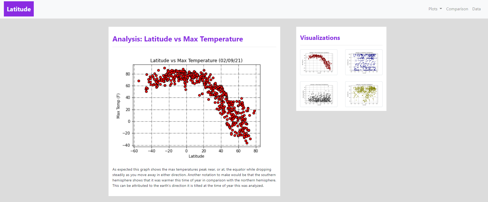
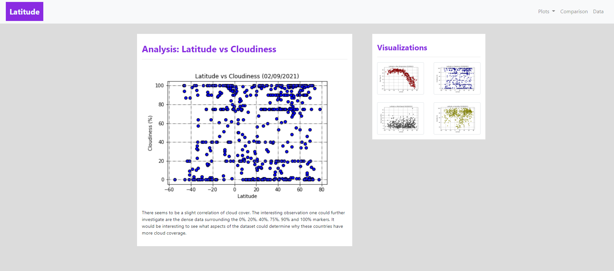
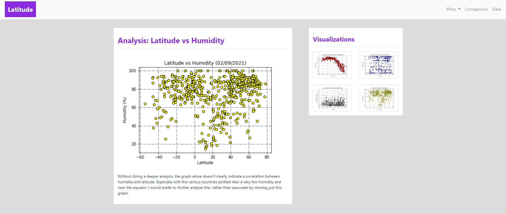
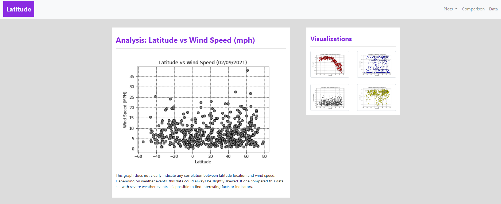

# Web Design Homework - Web Visualization Dashboard (Latitude)

## Latitude - Latitude Analysis Dashboard with Attitude

For this homework I've created a visualization dashboard website using visualizations I've created in a past assignment.

In building this dashboard, I've created individual pages for each plot and a means by which a person can navigate between them. These pages will contain the visualizations and their corresponding explanations. I've also have a landing page, a page where you can see a comparison of all of the plots, and another page where you can view the data used to build them.

The website must consist of 7 pages total, including:

* A landing page containing:
  * An explanation of the project.
  * Links to each visualizations page. There should be a sidebar containing preview images of each plot, and clicking an image should take the user to that visualization.

  Place holder for landing page image
  

* Four visualization pages, each with:
  * A descriptive title and heading tag.
  * The plot/visualization itself for the selected comparison.
  * A paragraph describing the plot and its significance.

  Max Temperature Analysis Page
  

  Cloudiness Analysis Page
  

  Humidity Analysis Page
  

  Wind Speed Analsyis Page
  

* A ["Comparisons" page](#comparisons-page) that:
  * Contains all of the visualizations on the same page so we can easily visually compare them.
  * Uses a Bootstrap grid for the visualizations.
    * The grid must be two visualizations across on screens medium and larger, and 1 across on extra-small and small screens.

    Place holder for comparison page image
    

* A ["Data" page](#data-page) that:
  * Displays a responsive table containing the data used in the visualizations.
    * The table must be a bootstrap table component.  
    * The data must come from exporting the `.csv` file as HTML, or converting it to HTML. Try using a tool you already know, pandas. Pandas has a nifty method approprately called `to_html` that allows you to generate a HTML table from a pandas dataframe.

    Place holder for data page image
    
